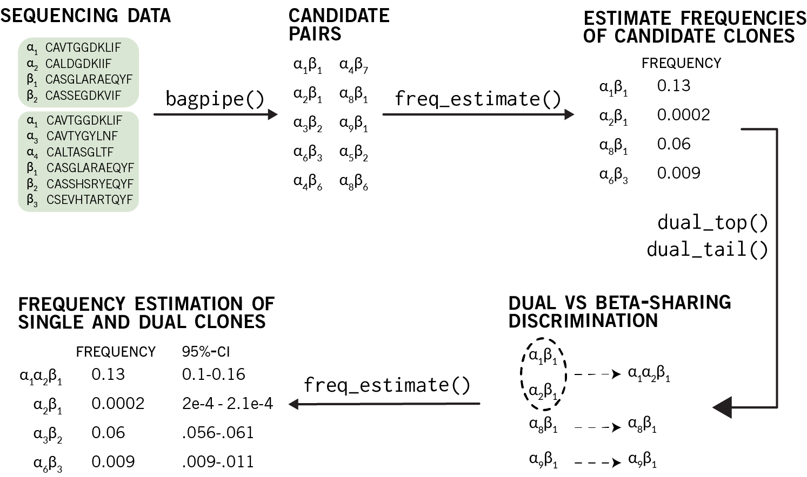

Introduction
============

A Brief Welcome
---------------

Welcome to the `alphabetr` vignette! We've spent a lot of time trying to develop a TCR sequencing approach that is more scaleable than single-cell sequencing, and we're excited for others to use our approach. My hope is that this vignette will be clear and transparent in showing how we thought to solve this problem, not as be-all panacea for our sequencing woes but as one step towards the field closer to a gold standard. The main purpose of this vignette is to demonstrate how to obtain the results of our paper[1] and how to do simulations of your own.

Immunology background
---------------------

T cell receptors (TCR) are heterodimers of two chains, an alpha chain and a beta chain. Identifying TCRs of T cell clones at a minimum requires the identification of the pair of CDR3 sequences of the alpha and beta chains.

Overview of the code
====================

We'll start by looking at an overview of how to run the `alphabetr` functions on the sequencing data and then look at the parameters used to simulate the sequencing data.

Importing data
--------------

Sequencing data obtained with the alphabetr approach can be imported into R using the `read_alphabetr()` function.

Processing the sequencing data
------------------------------

Our goals are to:

1.  Determine alpha-beta candidate pairs
2.  Discriminate between dual-alpha TCR clones and beta-sharing clones
3.  Estimate clonal frequencies

**Determining candidate pairs.** We input the sequencing data into `bagpipe()`, which determines candidate alpha-beta pairs. The output of `bagpipe()` determines pairs consisting of only one alpha and one beta.

**Discriminating dual-alpha and beta-sharing clones.** We then utilize `freq_estimate()`and then use those estimates in the `dual_top()`/`dual_tail()` functions. Although it seems backwards to estimate clonal frequencies before determining dual-alpha clones, `dual_top()`/`dual_tail()` need these frequencies to determine the dual clones[2] `dual_top()`/`dual_tail()` will then tell us which candidates that share the same beta are actually one clone express both alpha chains.

**Estimating clonal frequencies.** The final list of candidate clones, which includes both single-alpha and dual-alpha clones, is then passed into `freq_estimate()` in order to get a final list of frequen estimates and 95% frequency confidence intervals. The package includes some helper functions to amend the original list of candidate pairs with the newly determined dual-alpha clones (used below in the rest of the vignette).

<!-- ```{r echo = FALSE, out.width = 650, fig.retina = NULL, fig.cap = "Figure 1"} -->
<!--  -->
<!-- ``` -->
Installing and loading alphabetr
--------------------------------

The package is currently not on CRAN and must be installed from github. The easiet way to do this is through the `devtools` package. If you don't have `devtools` installed, run the following

``` r
install.packages("devtools")
```

With `devtools` installed, install alphabetr by running

``` r
devtools::install_github("edwardslee/alphabetr")
```

And then load the package by running

``` r
library(alphabetr)
```

Formatting and inputting sequencing data for `alphabetr`
--------------------------------------------------------

The package includes the function `read_alphabetr()` that will up convert sequencing data to the format used by `alphabetr`. `read_alphabetr()` will accept two forms of CSV files:

1.  A 3-column csv file containing both TCRA and TCRB sequencing information

-   1st column named `chain`: indentification of `"TCRA"`/`"TCRB"` or `"alpha"`/`"beta"`
-   2nd column named `well`: well number that the chain derives from
-   3rd column named `cdr3`: the CDR3 sequence

1.  Two 2-column csv files, one containing TCRA sequencing information and the other containing TCRB sequencing information. Each csv file has the following columns

-   1st column named `well`: well number that the chain derives from
-   2nd column named `cdr3`: the CDR3 sequence

The following is a csv file in the 3-column form

``` r
# using a string to be read as a csv file (ignore this and see next line of code)
strcsv <-'"chain","well","cdr3"\n"alpha","1","CAVTGGDKLIF"\n"alpha","1","CALDGDKIIF"\n"alpha","2","CAVTGGDKLIF"\n"beta","1","CASGLARAEQYF"\n"beta","2","CASSEGDKVIF"\n"beta","2","CSEVHTARTQYF"'
con <- textConnection(strcsv)
csv3 <- read.csv(con)

# looking at the csv file
head(csv3)
#>   chain well         cdr3
#> 1 alpha    1  CAVTGGDKLIF
#> 2 alpha    1   CALDGDKIIF
#> 3 alpha    2  CAVTGGDKLIF
#> 4  beta    1 CASGLARAEQYF
#> 5  beta    2  CASSEGDKVIF
#> 6  beta    2 CSEVHTARTQYF
```

And the following is the same data in two 2-column csv files:

``` r
# TCRA file
strcsv <-'"well","cdr3"\n"1","CAVTGGDKLIF"\n"1","CALDGDKIIF"\n"2","CAVTGGDKLIF"'
con_alpha <- textConnection(strcsv)
csv2_alpha <- read.csv(con_alpha)

# TCRB file
strcsv <-'"well","cdr3"\n"1","CASGLARAEQYF"\n"2","CASSEGDKVIF"\n"2","CSEVHTARTQYF"'
con_beta <- textConnection(strcsv)
csv2_beta <- read.csv(con_beta)

head(csv2_alpha)
#>   well        cdr3
#> 1    1 CAVTGGDKLIF
#> 2    1  CALDGDKIIF
#> 3    2 CAVTGGDKLIF
head(csv2_beta)
#>   well         cdr3
#> 1    1 CASGLARAEQYF
#> 2    2  CASSEGDKVIF
#> 3    2 CSEVHTARTQYF
```

To load your csv files, the call of `read_alphabetr()` differs depending on the format of your csv file(s)

``` r
# if using one 3 column csv file, using the data argument
dat <- read_alphabetr(data = "alphabetr_data.csv")

# if using two 2 col csv files, use the data_alpha and data_beta arguments
dat <- read_alphabetr(data_alpha = "alphabetr_data_alpha.csv"
                      data_beta  = "alphabetr_data_beta.csv")
```

Just to demonstrate with the dummy csv file we created just before:

``` r
# using a string to be read as a csv file (ignore this and see next line of code)
strcsv <-'"chain","well","cdr3"\n"alpha","1","CAVTGGDKLIF"\n"alpha","1","CALDGDKIIF"\n"alpha","2","CAVTGGDKLIF"\n"beta","1","CASGLARAEQYF"\n"beta","2","CASSEGDKVIF"\n"beta","2","CSEVHTARTQYF"'
con <- textConnection(strcsv)

# importing the csv file into the format that alphabetr will use
dat <- read_alphabetr(data = con)
dat
#> $alpha
#>      [,1] [,2]
#> [1,]    1    1
#> [2,]    1    0
#> 
#> $beta
#>      [,1] [,2] [,3]
#> [1,]    1    0    0
#> [2,]    0    1    1
#> 
#> $alpha_lib
#> [1] "CAVTGGDKLIF" "CALDGDKIIF" 
#> 
#> $beta_lib
#> [1] "CASGLARAEQYF" "CASSEGDKVIF"  "CSEVHTARTQYF"
```

The output of `read_alphabetr()` is a list of length four. The `alpha` component contains the binary matrix that represents which alpha chains (indexed by column) are found in which wells (indexed by row). The `beta` component is the analogous binary matrix for beta chains. The `alpha_lib` and `beta_lib` are vectors that indicate the actual CDR3 sequences for each chain. For example,

``` r
# the cdr3 sequence of alpha_2
dat$alpha_lib[2]
#> [1] "CALDGDKIIF"

# the cdr3 sequence of beta_3
dat$beta_lib[3]
#> [1] "CSEVHTARTQYF"
```

The rest of the vignette will discuss how to perform simulations on synthetic data sets (by using the function `create_clones()` and `create_data()`). The output of `create_data()` is the same way as the output of `read_alphabetr()` would be used, and so although the rest of the vignette is about performing simulations, the same exact can be used on real data that is processed by `read_alphabetr()`.

Simulating sequencing data
--------------------------

Simulating the experimental data involves choosing parameters for two domains:

1.  The clonal structure of the T cell population of interest
2.  The sequencing experiment

<!-- Both are described in Figure . -->
**Clonal structure.** We create a T cell population using the function `create_clones()`, which is fully described below, so all I want to do is illustrate what *degree of sharing* means. Suppose the clones in Figure represent our population of interest. We have four unique alpha chains (a1, a2, a3, a4), one of which is shared by two clones (a2 is shared by a2b1, a2b3). In this population, 25% of the alpha chains are shared by two clones, and 75% of the alpha chains are not shared.

**Simulating the sequencing experiment.** Just a remark that there's a lot of parameters to simulate on the experimental side of things.

Running the code
================

This section of the vignette will show you how to run simulations from start to finish in order to obtain the type of results as shown in the paper. We will first create T cell populations with user-specified attributes, use functions in `alphabetr` to figure our candidates pairs, discriminate between dual-alpha and beta-sharing clones, and then determine clonal frequencies.

Creating the clonal structure of the T cell population
------------------------------------------------------

`create_clones()` will create a T cell population with a structure specified by you. The attributes that can be changed are

1.  The number of unique beta chains
2.  The proportion of clones with dual beta chains
3.  The proportion of clones with dual alpha chains
4.  The degree of alpha sharing (the proportion of clones that share 1-7 alpha chains)
5.  The degree of beta sharing (the proportion of clones that share 1-5 beta chains)

In order to create a population containing

-   1000 unique beta chains
-   5% of clones with dual beta TCRs
-   30% of clones with dual alpha TCRs
-   beta-sharing: 75% beta shared by one clone, 20% by two clones, 5% by three clones
-   alpha-sharing: 80% alpha chains shared by one clone, 15% by two clones, and 5% by three clones

We run the following

``` r
set.seed(290)   # to make the results reproducible
clonal <- create_clones(numb_beta = 1000,
                        dual_beta = 0.05,
                        dual_alpha = .3,
                        alpha_sharing = c(0.80, 0.15, 0.05),
                        beta_sharing  = c(0.75, 0.20, 0.05))
```

The function arguments are fairly straightforward: `numb_beta` is the number of unique beta chains in the population, `dual` is the proportion of clones with dual alpha chains, and `alpha_sharing` and `beta_sharing` are the vectors that represent the degree of sharing. Position `i` of the sharing vectors represent the proportion of the chains shared by `i` clones.

The output is a list containing different useful versions of the clonal structure

``` r
# Clones ordered by beta index
ordered_clones <- clonal$ordered

# Clones randomly ordered in order to assign random clonal frequencies later 
random_clones <- clonal$TCR

# Clones that express two different alpha chains and two different beta chains
dual_alpha <- clonal$dual_alpha
dual_beta  <- clonal$dual_beta
```

Each of these are 3 column matrices, where each row represents a clone, the first column is the beta chain index, and the second and third columns are the alpha indices. If the clone expresses only one alpha chain, then the 2nd and 3rd columns will be equal. For example,

``` r
# single TCR clones
random_clones[5:7, ]
#>      beta1 beta2 alpha1 alpha2
#> [1,]   383   383    519    519
#> [2,]   753   753   1031   1031
#> [3,]   353   353   1121   1121

# dual TCR-alpha clones
random_clones[49:50, ]
#>      beta1 beta2 alpha1 alpha2
#> [1,]   477   477    372    116
#> [2,]   645   645    851    123

# dual TCR-beta clones
random_clones[47:48, ]
#>      beta1 beta2 alpha1 alpha2
#> [1,]   821   318    287    287
#> [2,]   408   170    638    638
```

For the paper, the clonal structures were created with the following code

``` r
# Sharing vectors; with this, 1692 beta chains results in 2100 unique clones
share_alph <- c(.816, .085, .021, .007, .033, .005, .033)
share_beta <- c(.859, .076, .037, .019, .009)

# Creating a population of 2100 clones with specified sharing and
# 30% dual-alpha clones and 6% dual-beta clones
set.seed(258)   # reproducibility for the vignette
TCR_pairings <- create_clones(numb_beta = 1787,
                              dual_beta = 0.06,
                              dual_alpha = 0.3,
                              alpha_sharing = share_alph,
                              beta_sharing = share_beta)
TCR_clones <- TCR_pairings$TCR
```

We'll use `TCR_clones`, which contains the clones in random order, in the next section to simulate sequencing data.

Simulating a TCR sequencing experiment
--------------------------------------

Now that we've created the clones with their alpha and beta sequences (with each unique chain represented by an integer/index), we can simulate sequencing data. We do this by using the function `create_data()`. `create_data()` will sample the clones from a skewed distribution into the wells of 96-well plates, which is what would happen in a sequencing experiment by staining T cells with tetramer and using a sorter to sample them into plates.

A number of experimental parameters can be changed to simulate different experimental settings. These parameters and their corresponding arguments in `create_data()` are

1.  `plates`: the number of 96-well plates used in the experiment
2.  `error_drop`: a vector that contains the mean error "drop-out" rate and the standard deviation of the error rate (if using a lognormal error model). The drop rate is the probability that the chains of a clone can fail to be sequenced (and thus not appear in our final data set)

-   This is a vector of length 2, where the first element is the mean, and the second element is the standard deviation
-   The first element of `error_mode` determines whether the error rates are constant or drawn from a lognormal distribution
-   If you specify a constant rate, then the function will ignore the standard deviation element specified for `error_drop`

1.  `error_seq`: a vector that contains the mean "in-frame" sequencing error rate and the standard deviation of the error rate if using a lognormal error model. This is the probability that a given chain will be sequenced incorrectly and produce an incorrect "false" sequence (which cannot distinguished from "true" sequences).

-   As above with `error_drop`, this argument is a vector of length 2 where the first element is the mean and the second element is the standard deviation
-   The second element of `error_mode` determines whether the error rates are constant or drawn from a lognormal distribution
-   If you specify a constant rate, then the function will ignore the standard deviation element specified for `error_drop`

1.  `error_mode`: a vector that specifies the error model of the drop errors and the in-frame errors

-   The first element of the vector specifies the drop errors
-   The second element of the vector specifies the in-frame errors
-   The options are `"constant"` for a constant error model or `"lognormal"` for error rates drawn from a lognormal distribution

1.  `skewed`: the number of clones that represent the "top proportion" of the population in frequency; this top "proportion" is specified in the `pct_top` argument
2.  `prop_top`: the proportion of the population by frequency that is represented by the top clones (of which there are `skewed` number of them)
3.  `dist`: to developed in the future, but this option controls the shape of the frequency distribution; always set to `"linear"` for now
4.  `numb_cells`: sampling strategy that keeps track of the sample sizes of the wells; more details below

`create_data()` takes a matrix of clones as an input, such as `TCR_clones`, and the order the clones appear in this matrix determines their relative frequencies. The first `skewed` number of rows of the input matrix is used as the clones representing the top proportion of the population, and `create_data()` internally distributes them in a descending, linear way across the top. The other clones of the tail then have the same frequency, all adding up to the tail proportion of the population.

To illustrate this better, if we were to pass `skewed = 25` and `prop_top = 0.6` into `create_data()`, then the clones represented by the first 25 rows of `TCR_clones` make up the top 60% of the population, and the other 2075 clones make the other 40% of the population.

The `numb_cells` argument is a 2 column matrix, where for each row, the 1st column represents the sample size in the well, and the 2nd column is the number of wells with that sample size. You must ensure that the number of wells specified by `numb_cells` is equal to `96 * number_plates`.

``` r
# 5 plates (= 480 wells), every well has a sample size of 50 cells
numb_cells <- matrix(c(50, 480), ncol = 2)

# 1 plate (= 96 wells), 48 wells with 100 cells/well, 48 wells with 200 cells/well
numb_cells <- matrix(c(100, 200, 48, 48), ncol = 2)
```

Here are the parameters used in the paper with the "high-mixed" sampling strategy:

``` r
# Different experimental parameters
number_plates <- 5        # five 96-well plates
err_drop <- c(0.15, .01)  # drop error rate distribution ~ lognormal(.15, .1)
err_seq  <- c(0.02, .005) # in frame error rate dist ~ lognormal(.02, .005)
err_mode <- c("constant", "constant") # lognormal error distributions
number_skewed <- 25       # 25 clones representing the top proportion of population
pct_top <- 0.5            # top of population represents 50% of population
dis_behavior <- "linear"  # only option avaiable is linear at the moment

# Mixed sampling strategy: 128 wells of 20 cells/well, 64 wells of 50 cells/well,
# 96 wells of 100 cells/well, 200 cells/well, 300 cells/well each
numb_cells <- matrix(c(20,  50, 100, 200, 300,
                       128, 64,  96,  96,  96), ncol = 2)

# Creating the data sets
data_tcr <- create_data(TCR = TCR_clones,
                        plates = number_plates,
                        error_drop = err_drop,
                        error_seq = err_seq,
                        error_mode = err_mode,
                        skewed = number_skewed,
                        prop_top = pct_top,
                        dist = dis_behavior,
                        numb_cells = numb_cells)

# Saving the data for alpha chains and data for beta chains
data_alph <- data_tcr$alpha
data_beta <- data_tcr$beta
```

The output of `create_data()` is a list, and the `alpha` and `beta` components contain the data for alpha chains and beta chains respectively. Each is a matrix where the rows represent the columns represent the chain indices and the row represents the well. If a well contains a chain, then the row representing that well has a 1 in the chain's column and 0 if the well does not contain that chain (e.g. if well \#25 contains beta 20, then `data_beta[25, 20]` is 1).

Finding candidate pairs
-----------------------

Now that we've created the data set, we can begin to apply the algorithms to determine TCRs. The default parameters should work sufficiently well for most data sets

``` r
# Normally you would want to set rep = 100 or more
pairs <- bagpipe(alpha = data_alph, beta = data_beta, rep = 5)
```

The output of `bagpipe` is a matrix with the candidate pairs and the proportion of replicates that each candidate pair appears in.

``` r
head(pairs)
#>      beta1 beta2 alpha1 alpha2 prop_replicates
#> [1,]     1     1    272    272             1.0
#> [2,]     3     3    935    935             1.0
#> [3,]     4     4    351    351             0.2
#> [4,]     4     4    935    935             0.6
#> [5,]     4     4   1118   1118             0.2
#> [6,]     5     5    714    714             1.0
```

You can clearly see that all of the candidate pairs are single TCR clones at this point. We will attempt to determine dual TCR clones later on in the vignette.

Before moving on, you may choose to the filter the candidate pairs with a threshold of the proportion of replicates that a candidate pair must appear in. Increasing the threshold will significantly decrease the false pairing rate (i.e. the rate at which incorrect pairs are identified) while sacrificing depth of the tail and depth of dual TCR-alpha clone identification.

Our own simulations seem to indicate that a threshold of 0.3 to 0.5 gives a good balance of false pairing rate, tail depth, and dual depth:

``` r
# remove candidate pairs that don't appear in more than 30% of replicates
pairs <- pairs[pairs[, "prop_replicates"] > .3, ]
head(pairs)
#>      beta1 beta2 alpha1 alpha2 prop_replicates
#> [1,]     1     1    272    272             1.0
#> [2,]     3     3    935    935             1.0
#> [3,]     4     4    935    935             0.6
#> [4,]     5     5    714    714             1.0
#> [5,]     6     6   1045   1045             1.0
#> [6,]     7     7    258    258             1.0
```

Performing frequency estimation on these pairs
----------------------------------------------

With the candidate alpha/beta pairs, we perform an initial frequency estimation as though each candidate pair represents a distinct clone. This is an immediately incorrect assumption because at this point: dual-alpha clones are represented as two distinct clones that share the same beta chain (e.g. if *β*<sub>1</sub>, *α*<sub>1</sub>, *α*<sub>2</sub> is a dual clone, then we will have two candidate pairs *β*<sub>1</sub>, *α*<sub>1</sub> and *β*<sub>1</sub>, *α*<sub>2</sub> at this point). We use the estimated frequencies in order to discriminate between beta-sharing clones and dual-alpha clones.

In order to perform frequency estimation, we use `freq_estimate()`. The arguments `alpha` and `beta` require the sequencing data sets about alpha and beta chains respectively; `pair` takes the output of `bagpipe`; `error` is the experimental error dropout rate; and `cells` is the sample sizes of the wells and the number of wells with those sample sizes (in the same format as `numb_cells` in `bagpipe()`).

Using the data and output of `bagipe()` from above, we perform frequency estimation:

``` r
freq_init <- freq_estimate(alpha = data_alph,
                           beta = data_beta,
                           pair = pairs,
                           error = 0.15,
                           numb_cells = numb_cells)
head(freq_init)
#>   beta1 beta2 alpha1 alpha2          MLE        CI_up       CI_low
#> 1     1     1    272    272 0.0003040555 0.0005074374 0.0001747017
#> 2     3     3    935    935 0.0002265519 0.0003916560 0.0001105269
#> 3     4     4    935    935 0.0003258786 0.0005390270 0.0001923780
#> 4     5     5    714    714 0.0003066693 0.0005094431 0.0001754589
#> 5     6     6   1045   1045 0.0003258786 0.0005380399 0.0001920682
#> 6     7     7    258    258 0.0003079321 0.0004802097 0.0001577869
#>      CI_length pct_replicates
#> 1 0.0003327357            1.0
#> 2 0.0002811291            1.0
#> 3 0.0003466491            0.6
#> 4 0.0003339843            1.0
#> 5 0.0003459717            1.0
#> 6 0.0003224229            1.0
```

You can see that the output shows you the alpha and beta indices of the clone, the frequency point estimate (under `MLE`), the upper and lower limits of the 95% confidence interval (`CI_up` and `CI_low` respectively), the length of the confidence interval, and the number of replicates each clone was found in during `bagpipe()`.

Discriminating beta-sharing and dual TCR-alpha clones
-----------------------------------------------------

In order to disciminate between beta-sharing and dual-alpha clones, we needed the frequency estimation of the candidate pairs given by `bagpipe()`, and the estimated frequencies are used to parse between these situations. Two different functions are needed for this: `dual_top()` is used to usually determine dual-alpha TCRs in more common clones, and `dual_tail()` is used to determine dual TCR-alpha TCRs in rare clones in the tail.

``` r
# determining duals in the top; note the use of the error rate
common_dual <- dual_top(alpha = data_alph,
                        beta = data_beta,
                        pair = freq_init,
                        error = err,
                        numb_cells = numb_cells)

# determining duals in the tail; note that this does NOT use the error rate
tail_dual <- dual_tail(alpha = data_alph,
                       beta = data_beta,
                       freq_results = freq_init,
                       numb_cells = numb_cells)
```

The arguments of these functions are the same arguments used before.

We combine the output of both functions to obtain a data frame with all of the dual clones:

``` r
clones_dual <- rbind(common_dual, tail_dual)
head(clones_dual)
#>   beta1 beta2 alpha1 alpha2
#> 1   258   258   1643    892
#> 2   570   570    373    141
#> 3   616   616   1280    648
#> 4   740   740    373   1280
#> 5  1205  1205     33    335
#> 6  1584  1584    944    141
```

Final frequency estimation
--------------------------

Now that we identified dual TCR-alpha clones, all that's left is to estimate their frequencies and replace the corresponding beta-sharing candidate pairs with the dual TCR-alpha clone:

``` r
# Find the frequencies of the newly identified dual clones
freq_dual <- freq_estimate(alpha = data_alph,
                           beta = data_beta,
                           pair = clones_dual,
                           error = 0.15,
                           numb_cells = numb_cells)

# Remove the candidate beta-sharing clones and replace with the dual clones
tcrpairs <- combine_freq_results(freq_init, freq_dual)
```

`combine_freq_results()` is a helper function that will combine the initial frequency results and the freshly calculated dual frequency results. It will find the two rows containing the candidate pairs that derived from the dual clone and replace it with the results of the dual clone. The first argument is the initial frequency results, and the second argument is the dual frequency results.

The final results of processing our TCR sequencing data is contained in our data frame `tcrpairs`

``` r
head(tcrpairs)
#>   beta1 beta2 alpha1 alpha2        MLE      CI_up     CI_low  CI_length
#> 1  1637  1637    373   1032 0.04271497 0.04651125 0.03201378 0.01449746
#> 2   258   258   1643    892 0.04146939 0.04507328 0.03123586 0.01383743
#> 3   801   801   1643   1643 0.04083954 0.04767091 0.03491152 0.01275939
#> 4   616   616   1280    648 0.04002182 0.04353211 0.02995146 0.01358065
#> 5   917   917    373    373 0.03696094 0.04328901 0.03151756 0.01177145
#> 6   605   605    157    157 0.03674642 0.04295367 0.03138863 0.01156504
#>   pct_replicates
#> 1           -1.0
#> 2           -1.0
#> 3            1.0
#> 4           -1.0
#> 5            0.6
#> 6            1.0
```

Note that if a clone is dual, then the `pct_replicates` column is set to -1.

Evaluation of results
---------------------

Two functions are included in the package to evaluate the performance of the frequency estimation and the dual discrimination. The function `dual_eval()` is used to determine how well the dual discrimination went.

``` r
dual_res <- dual_eval(duals = clones_dual,
                      pair = freq_init,
                      TCR = TCR_pairings$TCR,
                      number_skewed = number_skewed,
                      TCR_dual = TCR_pairings$dual_alpha)

# listing the false dual rate and the adjusted dual depths of the top and tail clones
dual_res$fdr
#> [1] 0.1946309
dual_res$adj_depth_top
#> [1] 0.8
dual_res$adj_depth_tail
#> [1] 0.9586777
```

The function `freq_eval()` is used to determine how precise the frequency estimates are and how many 95% confidence intervals contain the true clonal frequency.

``` r
freq_res <- freq_eval(freq = tcrpairs,
                      number_skewed = number_skewed,
                      TCR = TCR_pairings$TCR,
                      numb_clones = nrow(TCR_pairings$TCR),
                      prop_top = pct_top)

# CV of estimates and the proportion of CIs with correct frequency
freq_res$cv
#> [1] 0.08575125
freq_res$correct
#> [1] 0.84
```

[1] Paper was recently accepted by PLOS Computational Biology

[2] see the paper to understand the mathematics that's going on.
